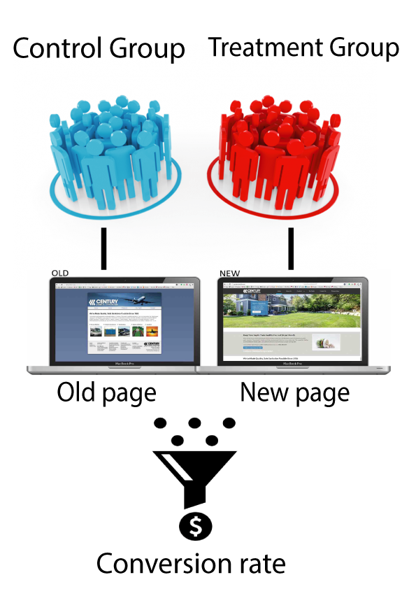

# A-B-Testing-In-Python
## Introduction

For this project, we will be working to understand the results of an A/B test run by an e-commerce website. Our goal is to help the company understand if they should implement the new page, keep the old page, or perhaps run the experiment longer to make their decision.

